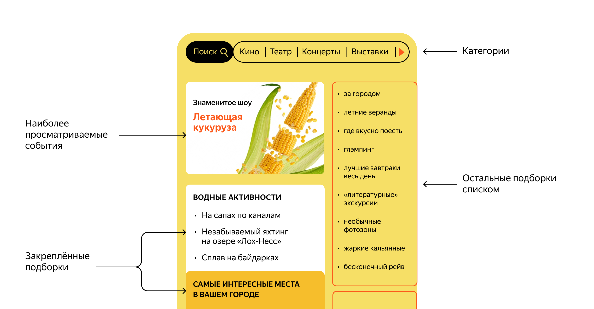

# java-explore-with-me

[Pull request link](https://github.com/OksanaVM/java-explore-with-me/pull/9)
## Проект "Explore With Me"

Приложение позволяет пользователям делиться информацией об интересных событиях и находить компанию для участия в них.
## Идея

Свободное время — ценный ресурс. Ежедневно мы планируем, как его потратить — куда и с кем сходить. Сложнее всего в таком планировании поиск информации и переговоры. Нужно учесть много деталей: какие намечаются мероприятия, свободны ли в этот момент друзья, как всех пригласить и где собраться.
Приложение, которое вы будете создавать, — афиша. В этой афише можно предложить какое-либо событие от выставки до похода в кино и собрать компанию для участия в нём.

Технологии: Java + Spring Boot + Maven + Lombok + RESTful API + PostgreSQL + Docker + Swagger

Реализованно два сервиса:
 1. Основной сервис будет содержать всё необходимое для работы продукта;
 2. Сервис статистики будет хранить количество просмотров и позволит делать различные выборки для анализа работы приложения.

Основной сервис:
 API основного сервиса разделено на три части:
 1. публичная доступна без регистрации любому пользователю сети;
 2. закрытая доступна только авторизованным пользователям;
 3. административная — для администраторов сервиса.

Функционал сервиса статистики содержит:
 1. запись информации о том, что был обработан запрос к эндпоинту API;
 2. предоставление статистики за выбранные даты по выбранному эндпоинту.

